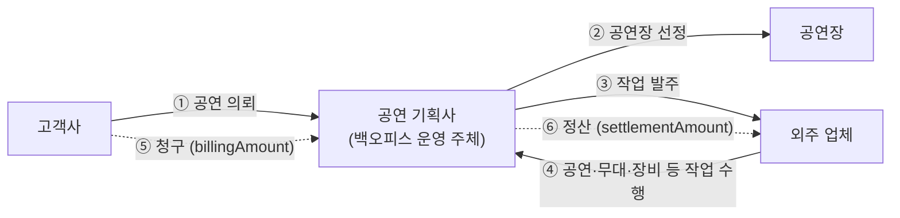
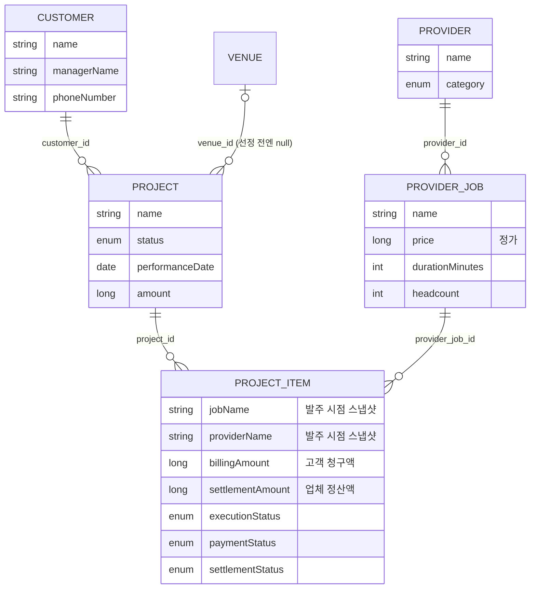

# theplay-backend

공연·이벤트 비즈니스 운영을 위한 백오피스 백엔드 서버입니다.

이전 로봇 서비스 회사 재직 당시 직접 개발·유지보수했던 백오피스의 business-server를 재구현한 프로젝트로, 아키텍처 설계와 관심사 분리를 직접 수행했습니다. 재직 당시의 코드는 AI를 활용하지 않고 모두 직접 구현했습니다.

고객사로부터 의뢰받은 공연 프로젝트를 중심으로, 외주 업체(공급자)와 업체가 제공하는 작업, 공연장, 보유 자산, 작업 공간을 관리합니다.

## 이 프로젝트로 보여주고자 하는 것

### 1. 객체지향적 코드를 이해하고 작성할 수 있습니다

- **애그리거트 중심 도메인 모델** — 모든 엔티티는 `AggregateRoot`를 상속하며, 도메인 이벤트 등록·발행(`popAllEvents`), 감사 필드(생성/수정/삭제 시각), Soft Delete 를 공통으로 책임집니다.
- **역할 분리된 공용 추상화** — `Specification`(검증 규칙), `DomainEventPublishRepositorySupport`(저장 시 이벤트 발행), 공통 응답/예외 처리를 `core-lib`로 분리해 서버 코드가 비즈니스에만 집중하도록 했습니다.

### 2. 현실 비즈니스를 데이터 모델링할 수 있습니다

- **청구와 정산의 분리** — 고객에게 청구하는 금액(`billingAmount`)과 외주 업체에 정산하는 금액(`settlementAmount`)은 현실에서 서로 다른 돈의 흐름이므로 분리해 모델링했습니다. 재능기부·무상 제공처럼 0원인 케이스도 허용하되 음수만 거절합니다.
- **독립적인 상태 추적** — 프로젝트 항목은 진행 상태 외에 실행(`ExecutionStatus`)·결제(`PaymentStatus`)·정산(`SettlementStatus`) 상태를 각각 추적합니다. 작업이 끝나도 결제·정산은 별개로 흘러가는 실제 업무 흐름을 반영한 것입니다.
- **애그리거트 간 ID 참조와 스냅샷** — 애그리거트끼리는 객체 참조 대신 ID로 참조해 경계를 명확히 하고, 프로젝트 항목에는 발주 시점의 작업명·업체명을 스냅샷으로 보관해 이후 원본이 바뀌어도 발주 내역이 보존되도록 했습니다.

### 3. 데이터 모델링을 근거로 비즈니스 로직을 작성할 수 있습니다

- **유스케이스 단위 애플리케이션 서비스** — `RegisterProjectItemService`, `GetAllProjectService`처럼 유스케이스 하나가 서비스 클래스 하나에 대응해, 변경의 이유가 하나로 좁혀집니다.
- **모델이 정의한 관계의 검증** — 프로젝트 항목 등록 시 프로젝트 → 업체 작업 → 업체로 이어지는 참조를 검증하고, 실패는 `ProjectNotFoundException` 같은 명시적 도메인 예외로 표현합니다.
- **동적 검색** — 도메인별 `SearchCondition`과 QueryDSL 기반 리포지토리 구현으로 조건 검색·페이징을 처리하며, 구현체는 infrastructure 계층에 격리했습니다.

### 4. 인프라를 함께 관리할 수 있습니다

- AWS 클라우드 기반 인프라 관리 경험이 있습니다.
- 환경별 설정(dev/beta/prod 프로필)을 분리하고, Docker 이미지 빌드 기반의 배포 흐름을 구성했습니다.

## 비즈니스 모형과 객체 분리

### 현실의 비즈니스 흐름

공연 기획사는 고객사에게 공연을 의뢰받아 프로젝트를 만들고, 공연장을 정한 뒤 필요한 작업(공연, 무대 설치, 장비 대여, 청소 등)을 외주 업체에 발주합니다. 공연이 끝나면 돈은 두 방향으로 흐릅니다 — 고객사에게는 **청구**하고, 외주 업체에는 **정산**합니다.



### 객체로의 분리

위 흐름을 그대로 애그리거트로 옮기면 아래와 같습니다. 애그리거트끼리는 객체 참조 대신 **ID로만 참조**해 경계를 유지합니다.



분리의 기준은 다음과 같습니다.

- **생명주기가 다르면 다른 애그리거트** — 고객사·외주 업체·공연장은 프로젝트가 생기기 전에도, 끝난 뒤에도 존재합니다. 프로젝트에 종속시키지 않고 독립 애그리거트로 두어 각자의 생명주기를 따르게 했습니다.
- **작업 목록과 발주 건의 분리** — `ProviderJob`은 업체가 제공하는 작업의 목록(정가·소요 시간·투입 인원)이고, `ProjectItem`은 특정 프로젝트에 실제로 발주한 작업 건입니다. 같은 작업이라도 프로젝트마다 협의된 금액이 다르므로, 발주 건이 자신의 금액을 따로 가집니다.
- **발주 시점의 사실은 스냅샷으로 보존** — 발주 후 업체가 작업명이나 상호를 바꿔도 이미 발주한 내역은 변하면 안 됩니다. `ProjectItem`은 `jobName`, `providerName`을 스냅샷으로 복사해 보관합니다.
- **하나의 작업 건, 두 개의 돈 흐름** — 현실에서 청구(고객→회사)와 정산(회사→업체)은 시점도 금액도 다르게 움직입니다. 그래서 `ProjectItem`이 `billingAmount`/`settlementAmount`와 `paymentStatus`/`settlementStatus`를 각각 독립적으로 추적합니다.
- **프로젝트에 종속되지 않는 회사 자원** — 보유 자산(`Asset`)과 작업 공간(`Workspace`)은 특정 프로젝트가 아니라 회사 운영에 속한 자원이므로 별도 애그리거트로 관리합니다.

## 기술 스택

- Java 21
- Spring Boot 3.5.4 (Web, Data JPA, Validation)
- QueryDSL 5.1.0 (Jakarta)
- H2 (dev 프로필 인메모리 DB, MySQL 호환 모드)
- Lombok, JUnit 5
- Gradle 멀티 모듈

## 모듈 구성

```
theplay-backend
├── core-lib          # 공용 라이브러리 (도메인 기반 클래스, 공통 응답/예외 처리)
└── business-server   # 비즈니스 API 서버 (실행 가능한 Spring Boot 애플리케이션)
```

### core-lib

여러 서버에서 재사용할 수 있는 공용 모듈로, Spring Boot 자동 구성(`CoreAutoConfiguration`)으로 등록됩니다.

- `domain` — `AggregateRoot`, `DomainEvent`, `Address` 값 객체
- `application` — `BusinessException`, `NotFoundException`, `Specification`
- `infrastructure` — `DomainEventPublishRepositorySupport`: 저장 시점에 애그리거트에 쌓인 도메인 이벤트를 발행
- `presentation` — 공통 응답 포맷(`Response`, `PageResource`, `Error`)과 전역 예외 처리(`ServerExceptionHandler`)

### business-server

서비스(도메인)별 패키지로 나뉘며, 각 서비스는 아래 계층 구조를 따릅니다.

```
presentation → application → domain ← infrastructure
```

| 서비스 | 설명 |
|---|---|
| `project` | 공연 프로젝트와 프로젝트 항목(`ProjectItem`) 관리. 항목별 청구/정산 비용 분리, 실행·결제·정산 상태 추적 |
| `customer` | 프로젝트를 의뢰하는 고객사 관리 |
| `provider` | 외주 업체 관리 (공연, 무대 설치, 청소, 장비 대여 등) |
| `provider_job` | 업체가 제공하는 작업(가격, 소요 시간, 투입 인원) 관리 |
| `venue` | 공연장 관리 (주소, 좌석 수, 실내/야외 여부) |
| `asset` | 보유 자산 관리 (조명, 음향, 무대, 악기, 차량 등의 카테고리와 사용 상태) |
| `workspace` | 사무실·창고 등 작업 공간 관리 |

## API

기본 경로는 `/api/v1`이며, 서비스별로 CRUD 및 검색 API를 제공합니다.

- `/api/v1/projects`, `/api/v1/project-items`
- `/api/v1/customers`
- `/api/v1/providers`, `/api/v1/provider-jobs`
- `/api/v1/venues`
- `/api/v1/assets`
- `/api/v1/workspaces`

헬스 체크: `GET /health`

## 실행 방법

### 로컬 실행

기본 프로필은 `dev`이며, 인메모리 H2 데이터베이스를 사용하므로 별도 DB 준비 없이 바로 실행할 수 있습니다.

```bash
./gradlew :business-server:bootRun
```

- 서버 포트: `8080`
- H2 콘솔: `http://localhost:8080/h2-console` (JDBC URL: `jdbc:h2:mem:theplay`, 사용자: `sa`)

### 테스트

```bash
./gradlew test
```

### Docker (dev)

```bash
./gradlew :business-server:bootJar
docker build -f business-server/src/main/resources/dev/Dockerfile -t theplay-business-server:dev .
docker run -p 8080:8080 theplay-business-server:dev
```

## 프로필

| 프로필 | 설정 파일 | 용도 |
|---|---|---|
| `dev` (기본) | `business-server/src/main/resources/dev/application.yml` | 로컬 개발, H2 인메모리 DB |
| `beta` | `business-server/src/main/resources/beta/application-beta.yml` | 베타 환경 |
| `prod` | `business-server/src/main/resources/prod/application-prod.yml` | 운영 환경 |
