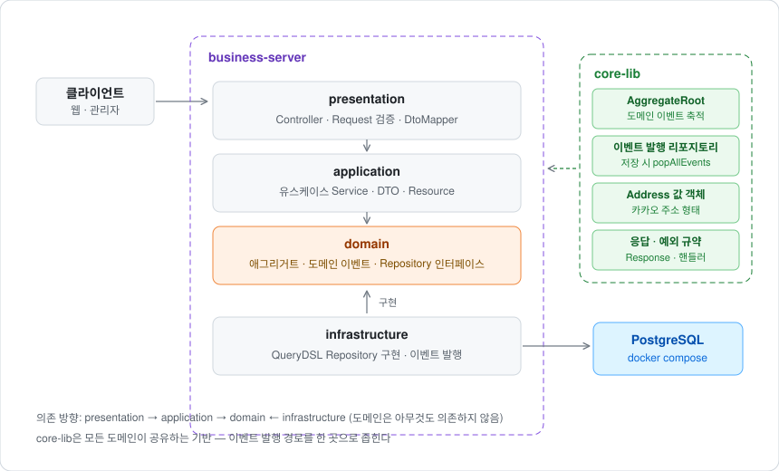
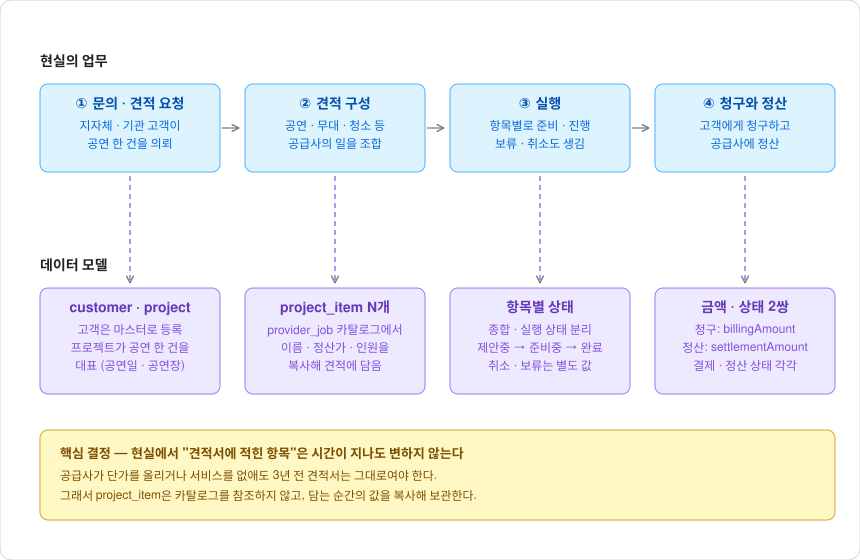
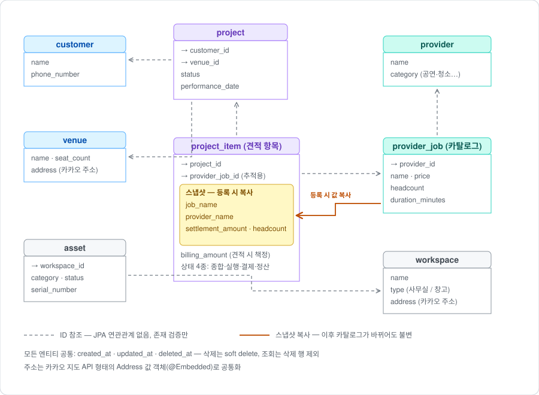

# theplay-backend

공연 기획·배급 플랫폼의 비즈니스 서버입니다.
고객(지자체·기관)의 공연 의뢰를 받아 공연팀·무대설치·청소 같은 공급사의 일을 조합해
견적을 만들고, 실행하고, 청구·정산까지 관리하는 업무를 데이터 모델로 옮겼습니다.

Java 21 · Spring Boot 3.5 · JPA · QueryDSL · PostgreSQL

## 전체 아키텍처



- **도메인마다 같은 4계층**(presentation → application → domain ← infrastructure)을 두고,
  유스케이스 하나당 Service와 Controller를 하나씩 둡니다. `RegisterProjectItemService`처럼
  파일 이름만으로 어떤 업무인지 읽히는 상태를 유지하기 위해서입니다.
- **domain은 아무것도 의존하지 않습니다.** Repository는 domain에 인터페이스로 선언하고
  infrastructure의 QueryDSL 구현체가 이를 구현합니다.
- **core-lib**은 모든 도메인이 공유하는 기반입니다. 특히 도메인 이벤트 발행 경로를
  `DomainEventPublishRepositorySupport` 한 곳으로 좁혀서, 새 도메인을 추가할 때
  "저장은 했는데 이벤트 발행을 빠뜨리는" 실수가 구조적으로 불가능하게 했습니다.

## 왜 이런 데이터 모델인가

### 현실의 업무 흐름

공연 대행은 "재판매업"에 가깝습니다. 고객이 공연 한 건을 의뢰하면, 회사는 공연팀·무대설치·
음향·청소 등 **여러 공급사의 일을 조합해 하나의 견적**을 만듭니다. 공연이 끝나면 고객에게
청구하고, 각 공급사에는 정산합니다. 받는 돈과 주는 돈의 차이가 마진입니다.



### 데이터 모델로 옮긴 형태



### 결정 1 — 공급사를 하나의 도메인으로 일반화

공연팀 도메인, 청소업체 도메인, 설치업체 도메인을 따로 만들지 않았습니다.
플랫폼 입장에서 이들은 전부 "일을 제공하는 상대"로 동일하게 다뤄지기 때문입니다.

- `provider` (공급사) — category로 분야만 구분 (PERFORMANCE, STAGE_SETUP, CLEANING, …)
- `provider_job` (제공 서비스) — 공급사 1 : 서비스 N. 공급사가 할 수 있는 일의 카탈로그

공연팀은 팀 자체가 PERFORMANCE 공급사로 등록되고 각 공연이 제공 서비스가 됩니다.
새로운 업종(케이터링, 경호 등)이 생겨도 category 값 하나만 늘어납니다.

### 결정 2 — 견적 항목은 참조가 아니라 스냅샷

현실에서 **3년 전 견적서는 지금 봐도 3년 전 모습 그대로**여야 합니다. 공급사가 단가를
올리거나 서비스를 카탈로그에서 없애도 과거 견적이 바뀌면 안 됩니다.

그래서 `project_item`은 `provider_job`을 참조해서 조회하지 않습니다. 견적에 담는 순간
서버가 카탈로그에서 **서비스명·공급사명·정산 단가·투입 인원을 복사**해 항목 안에 보관합니다.
`provider_job_id`는 "어디서 왔는지" 추적할 때만 씁니다. 커머스의 주문 항목(order item)이
주문 당시 상품명과 가격을 보관하는 것과 같은 패턴입니다.

부수 효과로 카탈로그의 수정·삭제가 과거 견적과 완전히 분리되어 자유로워집니다.

### 결정 3 — 청구와 정산은 금액도 상태도 별개

플랫폼은 돈 흐름의 중간에 있습니다. 고객 → 플랫폼(결제)과 플랫폼 → 공급사(정산)는
주체도 시점도 다릅니다. "고객 결제는 받았는데 공급사 정산은 아직"이 일상적인 상태입니다.

| | 금액 | 상태 | 값의 출처 |
|---|---|---|---|
| 청구 (고객 →) | `billing_amount` | `payment_status` | 견적 낼 때 플랫폼이 책정 — 요청으로 받음 |
| 정산 (→ 공급사) | `settlement_amount` | `settlement_status` | 카탈로그 단가의 등록 시점 스냅샷 |

두 금액의 차이가 항목별 마진입니다. 재능기부·무상 제공이 실제로 있으므로 두 금액 모두
0원을 허용하고 음수만 거절합니다.

### 결정 4 — 항목별 상태를 차원으로 분리

견적 항목 하나에는 서로 다른 축의 진행 상황이 공존합니다. 한 enum에 욱여넣으면
"준비는 끝났는데 결제가 안 된" 상태를 표현할 수 없습니다.

| 차원 | 값 |
|---|---|
| 종합 | WAITING → IN_PROGRESS → COMPLETED / CANCELED |
| 실행 | PROPOSED → PREPARING → DONE / CANCELED · ON_HOLD |
| 결제 | PAYMENT_PENDING → PAID |
| 정산 | SETTLEMENT_PENDING → SETTLED |

### 결정 5 — 애그리거트 간 참조는 ID로만

`project`는 `customer`·`venue`를, `project_item`은 `project`를 객체가 아닌 ID로 참조합니다.
JPA 연관관계를 걸면 코드는 짧아지지만 조회 한 번에 관련 없는 그래프가 끌려오고,
한 애그리거트가 다른 도메인의 규칙까지 건드릴 수 있게 됩니다.
존재 검증은 등록 시점에 각 도메인의 Repository로 확인합니다.

### 그 외 공통 규칙

- **soft delete** — 모든 삭제는 `deleted_at` 기록. 조회는 삭제 행을 항상 제외.
  견적·정산의 근거 데이터가 물리적으로 사라지면 안 되는 업무이기 때문입니다.
- **공통 시간 필드** — `created_at` · `updated_at` · `deleted_at`,
  응답은 `yyyy-MM-dd HH:mm:ss` 포맷으로 통일.
- **주소는 카카오 지도 API 형태 그대로** — `zipCode` · `regionDepth1~3` · `roadAddress` ·
  `jibunAddress` · `latitude` · `longitude`를 가진 `Address` 값 객체(@Embedded)를
  core-lib에 두고 공연장·업무공간이 공유합니다.

## 실행

```bash
docker compose up -d                  # PostgreSQL 16
./gradlew :business-server:bootRun    # 프로필 미지정 → dev
```

환경은 `SPRING_PROFILES_ACTIVE`로 전환합니다 (dev / beta / prod).
같은 Docker 이미지를 환경 변수만 바꿔 배포합니다.

```bash
./gradlew :business-server:bootJar
docker build -f business-server/src/main/resources/dev/Dockerfile -t theplay-backend .
docker run -e SPRING_PROFILES_ACTIVE=prod -p 8080:8080 theplay-backend
```

ddl-auto는 환경별로 다릅니다 — 공통 `update` / beta `none` / prod `validate`.

## API

모든 응답은 `{ "data": ..., "success": true/false, "errors": [...] }` 봉투를 공유하고,
실패 시 `errors[].field`로 어떤 입력이 문제인지 알립니다.

| Method | Path | 설명 |
|---|---|---|
| GET | `/health` | 헬스체크 |
| GET | `/api/v1/{domain}` | 목록 조회 — 검색 조건 + `page`·`size` (Pageable) |
| GET | `/api/v1/{domain}/{id}` | 개별 조회 |
| POST | `/api/v1/{domain}` | 생성 |
| DELETE | `/api/v1/{domain}/{id}` | 삭제 (soft delete) |

`{domain}`: `customers` · `workspaces` · `assets` · `providers` · `provider-jobs` ·
`venues` · `projects` · `project-items`

목록 검색 조건 — 값을 주지 않은 조건은 where 절에서 빠집니다 (QueryDSL 동적 조건):

| 도메인 | 조건 |
|---|---|
| customers | name, phoneNumber |
| workspaces | name, type |
| assets | name, category, status, workspaceId |
| providers | name, category |
| provider-jobs | name, providerId |
| venues | name, outdoor |
| projects | name, customerId, status, performanceDateFrom·To |
| project-items | projectId, providerJobId, status |

## 테스트

```bash
./gradlew :business-server:test
```

- 도메인별로 `fixture/`에 기본값이 채워진 빌더·요청 픽스처를 두고,
  테스트는 관심 있는 값만 덮어씁니다.
- 유스케이스(생성·개별 조회·목록·삭제)마다 `@WebMvcTest` 컨트롤러 슬라이스 테스트 —
  응답 형식, 검증 실패 필드, 상태 코드(201/400/404), 페이징을 검증합니다.
- 애그리거트에는 업무 규칙을 거치지 않는 `@Builder` 생성자를 별도로 두어
  픽스처가 특정 상태를 한 줄로 만들 수 있게 했습니다.
